# Ford+ — Documento de Cybersecurity da Sprint 3

**Projeto:** Challenge FIAP + Ford — Desafio 02: Boosting VIN Share in South America with Intelligent Solutions  
**Escopo analisado:** código, configuração e documentação presentes neste repositório. Este documento descreve o estado do protótipo; não é certificação, parecer jurídico ou evidência de execução em ambiente hospedado.

## Como interpretar os estados

- **IMPLEMENTADO:** há código ou configuração identificável no repositório. Isso não confirma, por si só, que o controle foi executado com sucesso.
- **PARCIALMENTE IMPLEMENTADO:** existe uma parte do controle, com lacuna relevante de cobertura, operação ou arquitetura.
- **NÃO IMPLEMENTADO:** não foi localizada implementação no escopo analisado.
- **NÃO APLICÁVEL:** não existe componente correspondente na arquitetura atual.
- **PLANEJADO PARA PRODUÇÃO:** recomendação futura, sem alegação de que já existe.

> O app é um protótipo acadêmico Expo/React Native. As rotas Expo API e o armazenamento de domínio em memória/AsyncStorage são demonstrações; não há backend de identidade ou banco de dados persistente integrado ao fluxo do aplicativo. Os prints indicados abaixo ainda precisam ser capturados pelo aluno; nenhum print ou resultado de execução foi fabricado.

## 1. Escopo, arquitetura e inventário

O projeto contém telas e dados demonstrativos para perfil, veículos, serviços/agendamentos e recompensas. A aplicação consulta FIPE e ViaCEP por HTTPS e usa concessionárias mockadas (`services/api.ts`, `constants/mockData.ts`). O repositório não contém Dockerfile, Terraform, Kubernetes, broker MQTT, ingestão de telemetria, coleta de localização ou banco persistente.

O código tem rotas Expo API para login, refresh, revogação, consulta/criação de veículos, auditoria administrativa e status de segurança. Contudo, `hooks/useAuth.tsx` chama diretamente `signIn`, `refreshSession` e `revokeSession` em `security/auth.ts`; portanto, a autenticação do app demonstrado é local e em memória, não uma sessão integrada a um serviço de identidade persistente. Os dados do usuário, veículo, serviço e recompensa usados pela interface ficam em AsyncStorage.

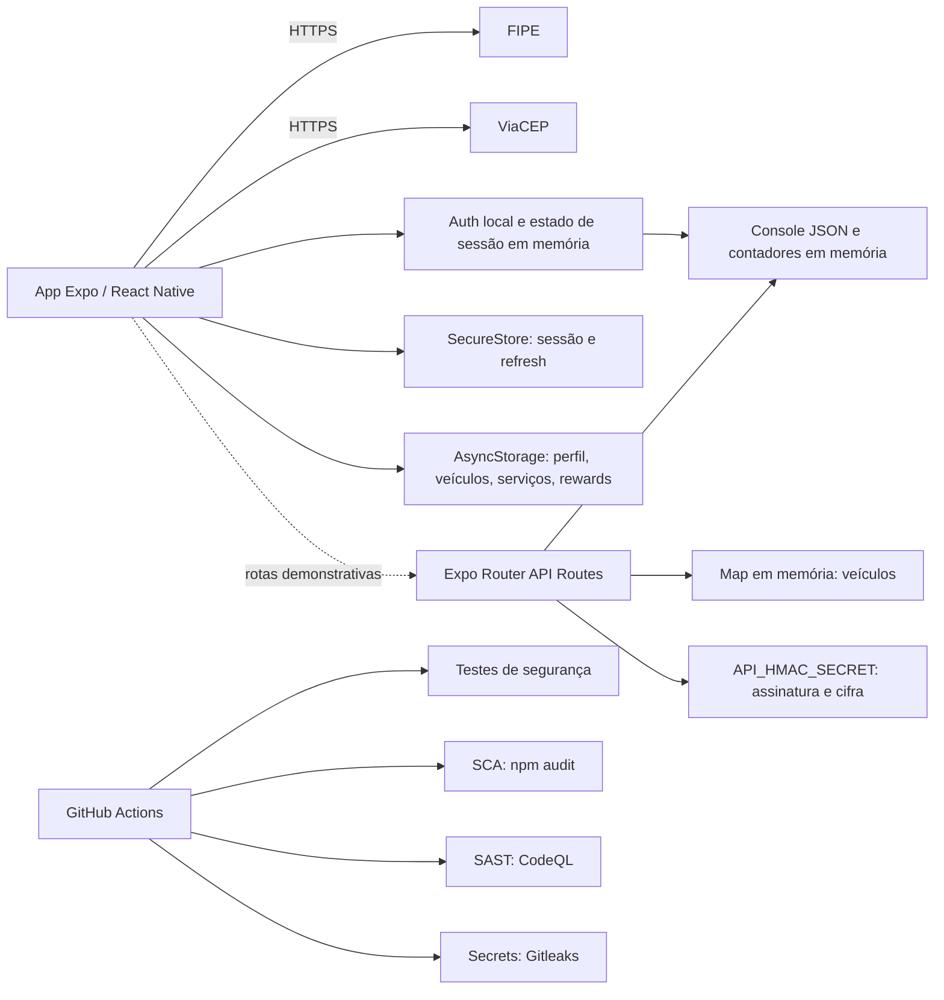
```mermaid
flowchart LR
  M[App Expo / React Native] -->|HTTPS| F[FIPE]
  M -->|HTTPS| V[ViaCEP]
  M --> L[Auth local e estado de sessão em memória]
  M --> K[SecureStore: sessão e refresh]
  M --> A[AsyncStorage: perfil, veículos, serviços, rewards]
  M -. rotas demonstrativas .-> API[Expo Router API Routes]
  API --> DB[Map em memória: veículos]
  API --> C[API_HMAC_SECRET: assinatura e cifra]
  L --> LOG[Console JSON e contadores em memória]
  API --> LOG
  CI[GitHub Actions] --> T[Testes de segurança]
  CI --> S[SCA: npm audit]
  CI --> Q[SAST: CodeQL]
  CI --> G[Secrets: Gitleaks]
```

Fronteiras de confiança: dispositivo e storage local; tráfego de saída para serviços externos; rotas API executadas no runtime Expo; e pipeline GitHub Actions. A integração das rotas API e a configuração de HTTPS em produção dependem da plataforma de deploy e não foram comprovadas neste repositório.

## 2. Pipeline DevSecOps integrado

### Estado observado

`.github/workflows/security.yml` configura execução em pull requests e em push para `main`/`master`. Os jobs definidos são testes de segurança, `npm audit --audit-level=high`, Gitleaks e CodeQL para JavaScript/TypeScript. `.github/dependabot.yml` agenda atualizações npm semanais. `.semgrep.yml` contém duas regras locais, mas Semgrep não é job do workflow e não há dependência declarada que assegure sua disponibilidade. Container scan não se aplica sem imagem de container.

| Etapa | Estado | O que comprova / lacuna |
|---|---|---|
| Testes de segurança | IMPLEMENTADO (configuração) | Workflow chama `npm run test:security`; resultado precisa ser capturado em execução real. |
| SAST | PARCIALMENTE IMPLEMENTADO | CodeQL está configurado no workflow. Semgrep tem regras, mas não está no CI. Status de execução e achados não foram verificados nesta auditoria. |
| SCA | IMPLEMENTADO (configuração) | `npm audit --audit-level=high` no workflow e Dependabot semanal. Resultado atual não foi executado/verificado nesta tarefa. |
| Secret scanning | IMPLEMENTADO (configuração) | Job Gitleaks configurado; não há prova de execução verde anexada. |
| Container security | NÃO APLICÁVEL | Não foi encontrado Dockerfile, imagem ou pipeline de container. |
| Gate de deploy | NÃO IMPLEMENTADO neste repositório | Workflow não define etapa de build/deploy nem regra de proteção/required checks do GitHub. Configuração de branch protection é externa e não foi inspecionada. |

Testes reduzem regressões conhecidas; SAST procura padrões de código vulnerável; SCA sinaliza versões vulneráveis; Gitleaks procura segredos versionados. Para que funcionem como gates efetivos, é necessário confirmar execuções no GitHub e configurar a proteção de branch. Semgrep pode ser adicionado ao CI depois de provisionar a ferramenta e definir severidades que falham o job.

GitHub Actions — workflow `Security Pipeline` — mostra execução real de cada job e seus estados
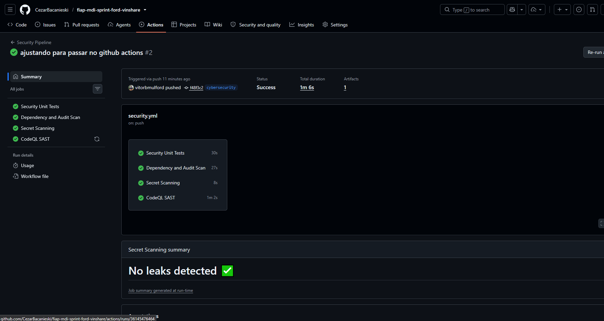

GitHub Actions — job `CodeQL SAST` — mostra execução e resultado concluído
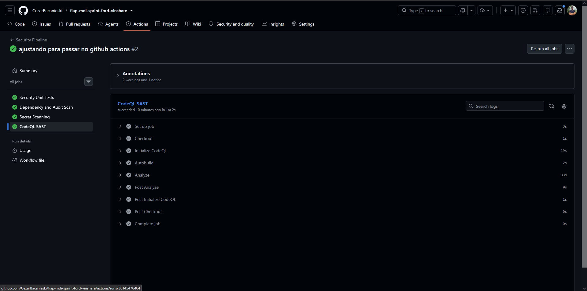

GitHub Actions — job `Secret Scanning` — mostra execução Gitleaks concluída
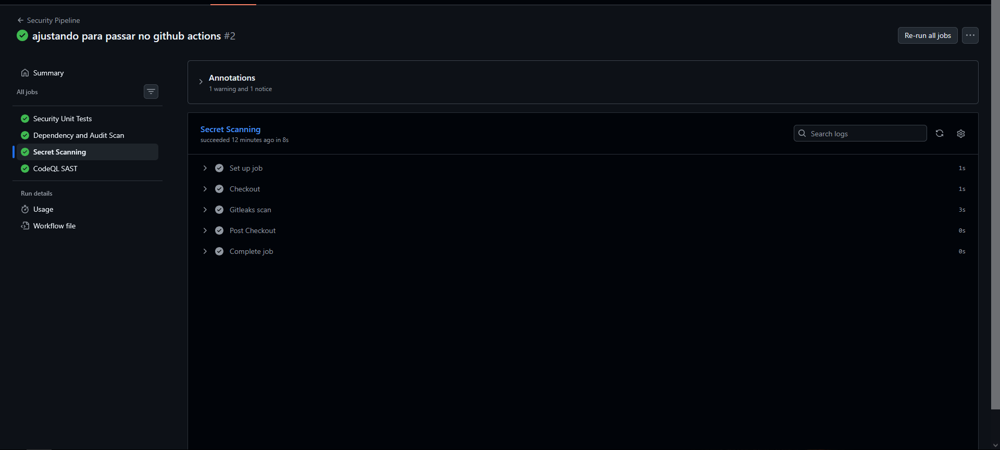

GitHub Actions — job `Dependency and Audit Scan` — mostra resultado real do `npm audit`, inclusive falha/achados se houver
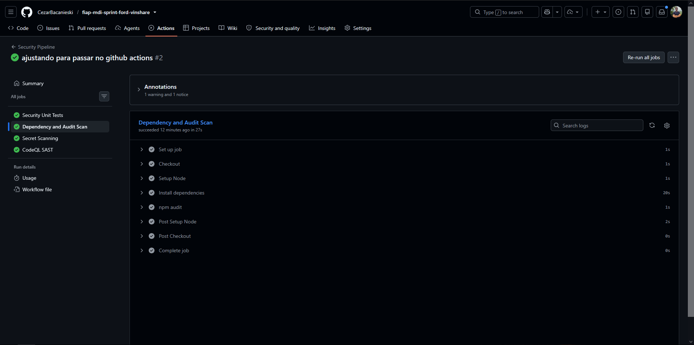

GitHub Dependabot — configuração ou PR de atualização npm — mostrar frequência semanal
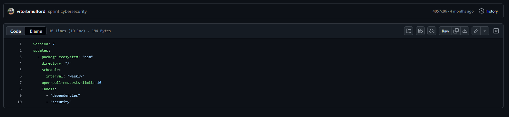

## 3. Segurança em código e infraestrutura

### Autenticação e sessão — PARCIALMENTE IMPLEMENTADO

O módulo `security/auth.ts` cria access tokens opacos com validade de 15 minutos e refresh tokens de 7 dias; implementa rotação, bloqueio de replay, revogação e respostas genéricas para credenciais inválidas. Limites de autenticação são cinco tentativas por janela de 10 minutos e bloqueio por 15 minutos (`security/rateLimiter.ts`). Sessões, identidades, tentativas e refresh usados residem em `Map`/`Set` em memória, então reinício do processo apaga o estado e múltiplas instâncias não compartilham revogações/limites. Os tokens são opacos, não JWT; portanto, JWT seguro é **NÃO IMPLEMENTADO**.

Limitações de alto impacto identificadas no código: a identidade de demonstração e sua senha são fixas em `security/auth.ts`; a tela preenche e-mail e senha de demonstração em `app/sign-in.tsx`; se Web Crypto não estiver disponível, a derivação cai para um hash FNV fraco (`weakHashFallback`). A implementação é exclusivamente acadêmica e não deve ser usada como autenticação de produção. Além disso, o login/refresco da interface não chama as rotas `app/api/auth/*`; elas existem como endpoints demonstrativos separados.

arquivo `app/sign-in.tsx` — linhas 13 a 18 — mostrar credenciais preenchidas para demonstração
arquivo `security/auth.ts` — linhas 19 a 29 e 245 a 325 — mostrar tempos, estado em memória, rotação, replay, revogação e validação do access token

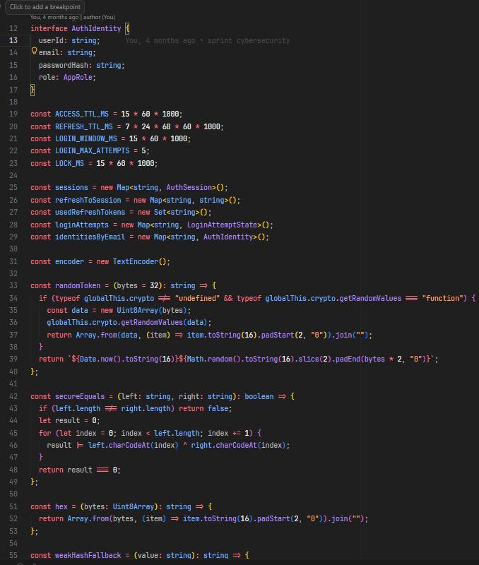
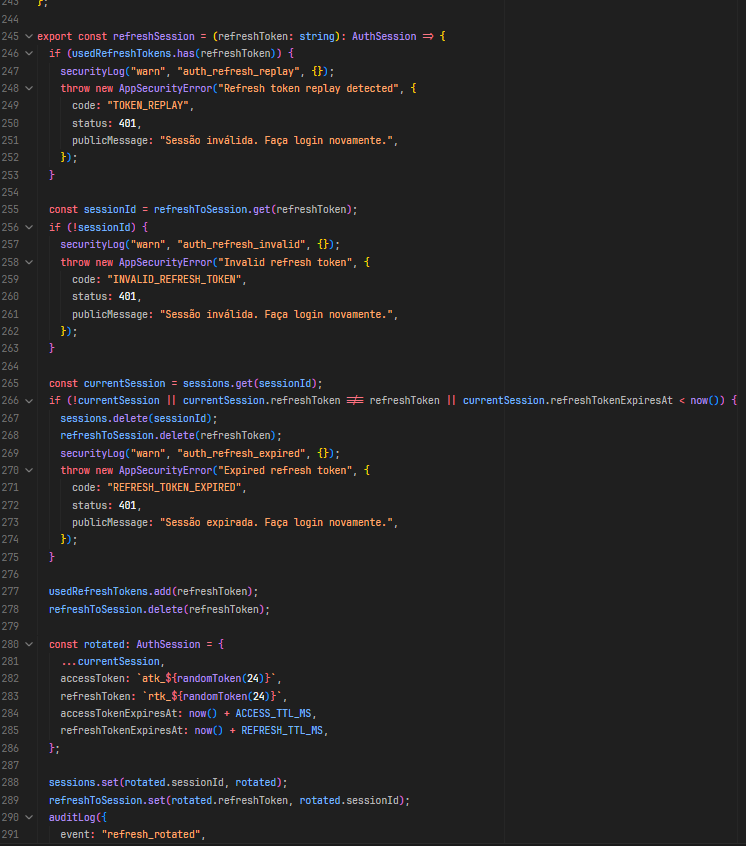

arquivo `security/auth.ts` — linhas 55 a 85 e 170 a 190 — mostrar fallback de hash e identidade de demonstração; evidência da limitação
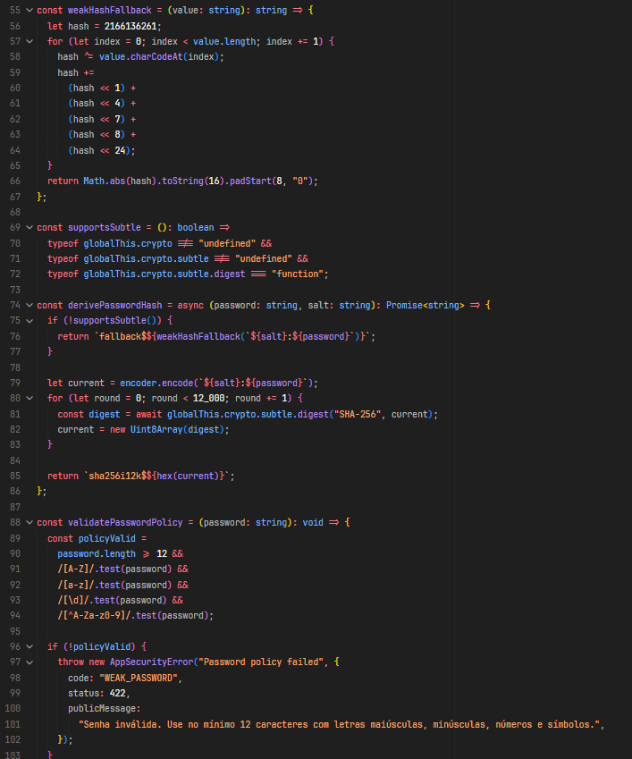
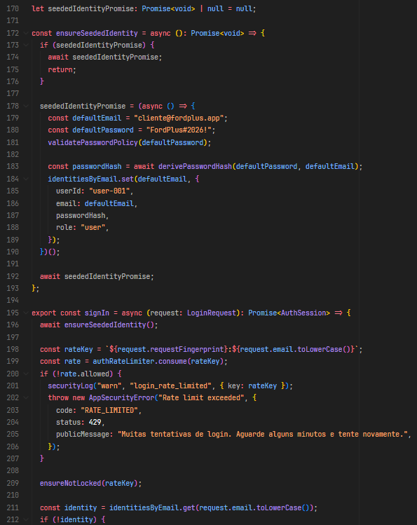

### Autorização RBAC — PARCIALMENTE IMPLEMENTADO

`security/permissions.ts` define papéis `admin`, `analyst` e `user` e permissões por ação. O endpoint administrativo exige `security:admin`; o endpoint de veículos valida token e permissão. A UI/hook também verifica permissões. O papel da identidade local é mockado como `user`; papéis e permissões não são mantidos por provedor de identidade central. `analyst` e `user` atualmente têm o mesmo conjunto de permissões, e nenhum mecanismo administrativo de provisionamento foi localizado.

arquivo `security/permissions.ts` — linhas 3 a 44 — mostrar papéis, permissões e negação por padrão para ação não autorizada
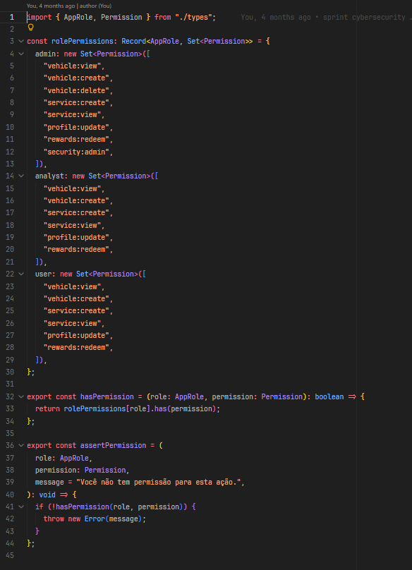

arquivo `app/api/admin/audit+api.ts` — linhas 15 a 33 — mostrar validação de token e exigência de `security:admin`
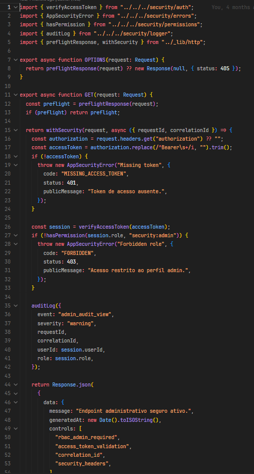

### APIs, validação e controles de rede — PARCIALMENTE IMPLEMENTADO

`app/api/_lib/http.ts` configura allowlist CORS, exige cabeçalho CSRF em métodos de escrita, aplica rate limit por IP de 80 requisições/minuto, limita o tamanho de corpo por rota, rejeita JSON inválido e chaves perigosas de prototype pollution, padroniza erros sem stack trace, adiciona request/correlation IDs e headers HTTP. `app/+middleware.ts` bloqueia alguns padrões conhecidos de caminho e user-agent; isso é filtro simples, não WAF. A checagem de HTTPS rejeita `x-forwarded-proto` quando presente e diferente de `https`; ausência do header passa, então não substitui configuração TLS confiável na borda.

Ponto de atenção: `preflightResponse` anuncia `Content-Type,Authorization,X-Payload-Signature,X-Request-ID`, mas não anuncia `X-CSRF-Token`, apesar de `withSecurity` exigi-lo em operações de escrita. Validar a compatibilidade desse preflight no ambiente de integração antes de considerar o fluxo operacional.

`security/validation.ts` e `security/sanitization.ts` aplicam normalização NFKC, padrões e limites para campos e IDs. Trata-se de validação por allowlist e regras auxiliares; filtros textuais genéricos não substituem queries parametrizadas ou encoding contextual em uma futura camada de banco/UI.

arquivo `app/api/_lib/http.ts` — linhas 5 a 20 e 30 a 71 — mostrar allowlist, headers, rate limit e exigência de CSRF
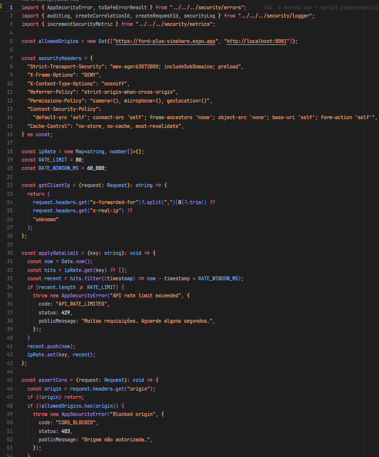
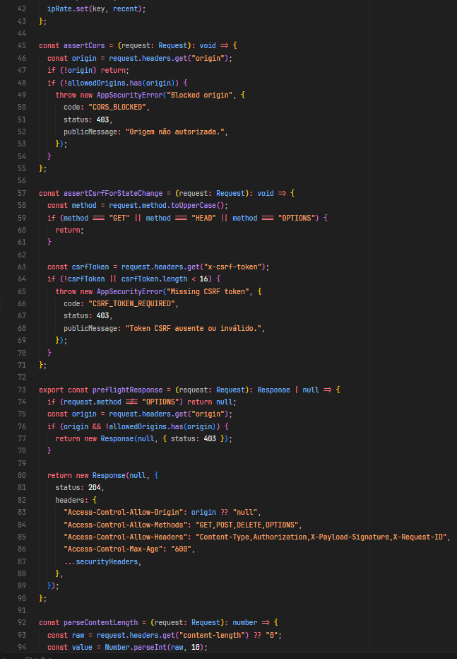

arquivo `app/api/_lib/http.ts` — linhas 73 a 145 e 148 a 214 — mostrar preflight, parsing limitado, proteção de prototype pollution e erros seguros
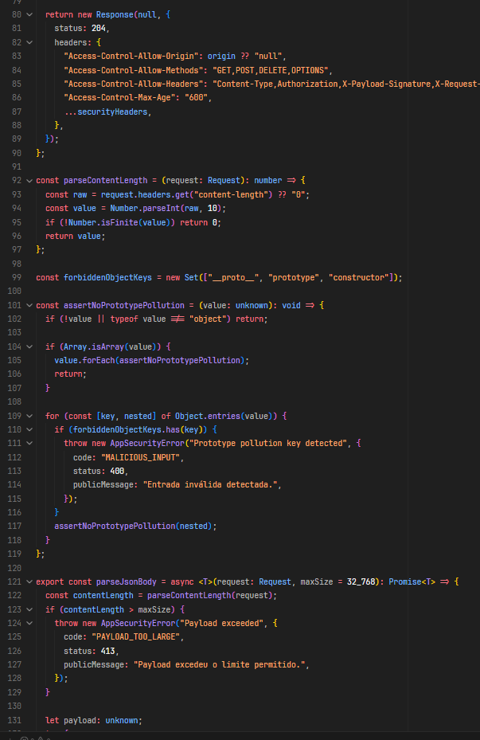

arquivo `security/validation.ts` — linhas 32 a 66 — mostrar sanitização de ID e validação de veículo
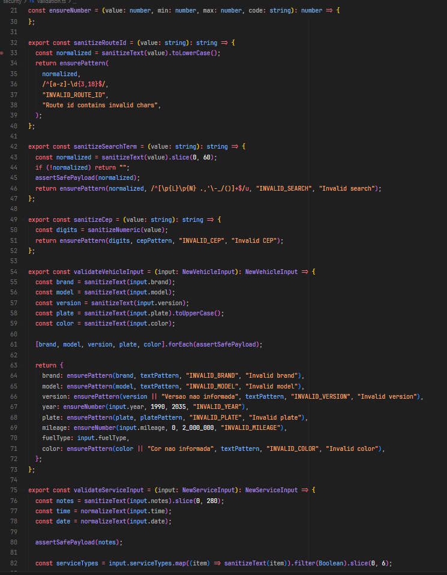

arquivo `security/sanitization.ts` — linhas 3 a 45 — mostrar normalização e filtros de entradas
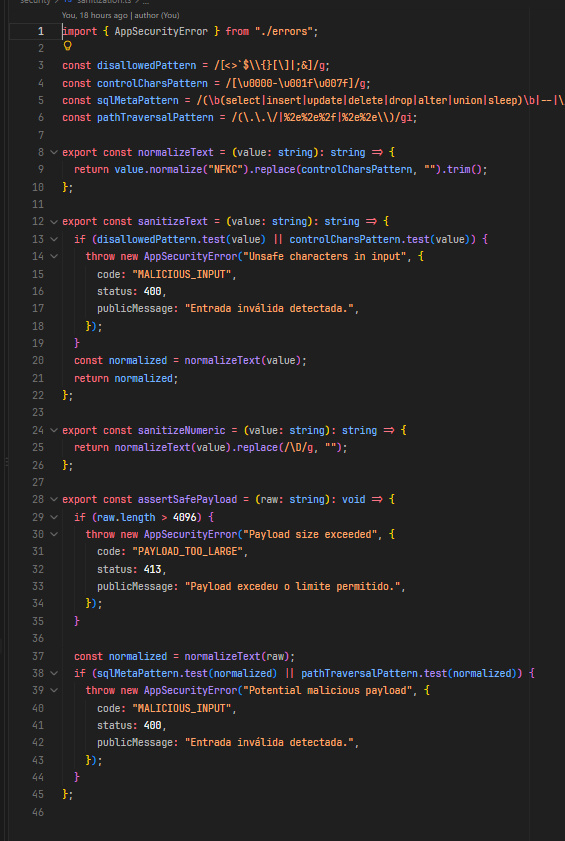

### Criptografia e armazenamento — PARCIALMENTE IMPLEMENTADO

`services/storage.ts` usa `expo-secure-store` para sessão e refresh; perfil, veículos, serviços, recompensas e preferências usam AsyncStorage sem criptografia implementada pelo app. A documentação versionada do Expo SDK 55 identifica `expo-secure-store` como pacote disponível; isso não significa que todo o storage do app esteja protegido.

As rotas API cifram placa/chassi com AES-GCM usando segredo de ambiente em `app/api/_lib/serverCrypto.ts`, e mascaram valores nas respostas. O banco é um `Map` em memória; não há leitura/descriptografia persistente implementada. Em `app/api/_lib/payloadSignature.ts`, a assinatura HMAC usa valor padrão acadêmico quando `API_HMAC_SECRET` não está definido. Esse fallback invalida qualquer alegação de segredo forte em produção; a chave real deve ser fornecida por secret manager e o fallback removido. `.env.example` traz apenas valor placeholder.

arquivo `services/storage.ts` — linhas 21 a 59 — mostrar quais chaves usam SecureStore e quais continuam em AsyncStorage
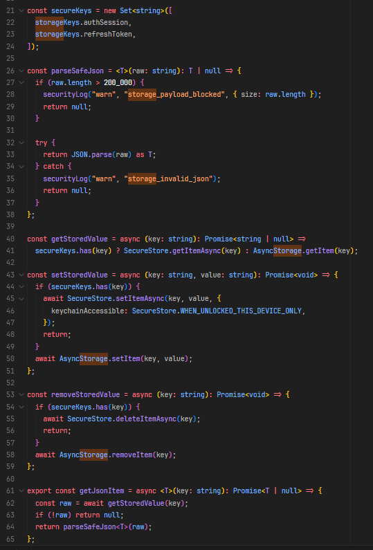

arquivo `app/api/_lib/serverCrypto.ts` — linhas 6 a 23 — mostrar exigência de segredo, AES-GCM e IV aleatório
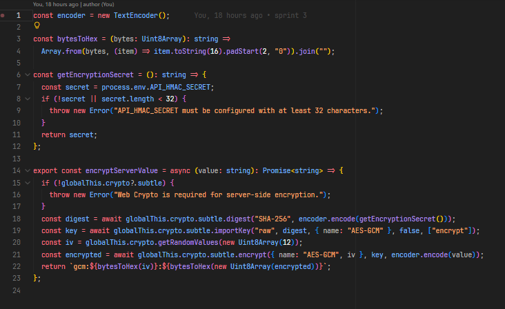

arquivo `app/api/_lib/payloadSignature.ts` — linhas 5 a 28 e 40 a 57 — mostrar HMAC e fallback de segredo acadêmico; evidência da limitação
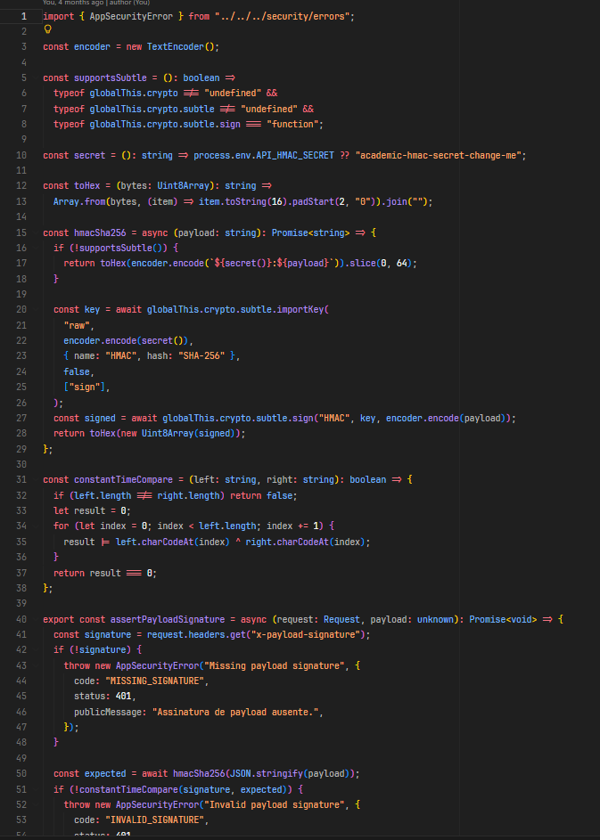

arquivo `app.json` — linhas 35 a 52 — mostrar plugins Expo SDK 55 e configuração SecureStore/headers]
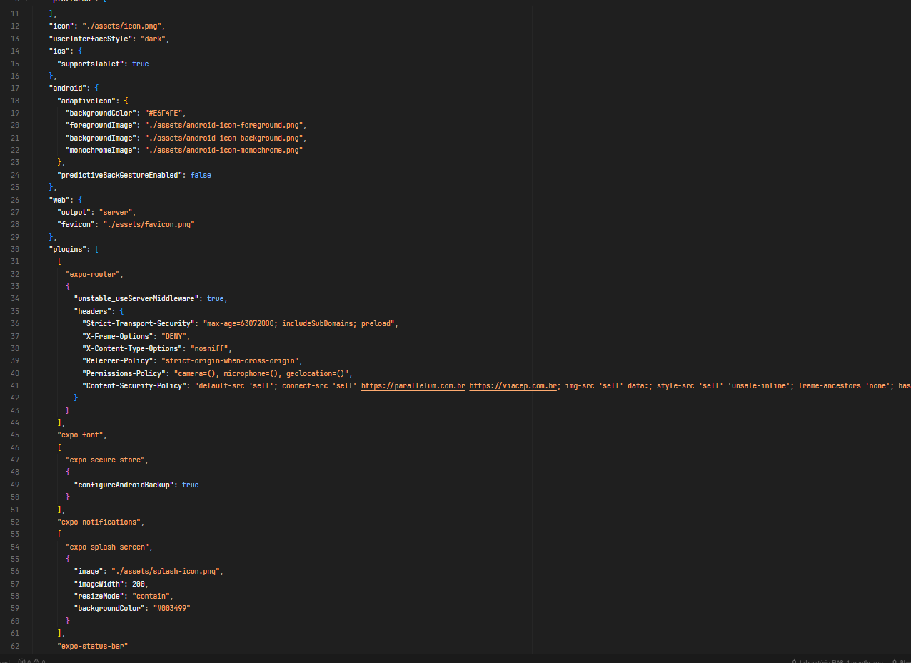
### Outros controles de infraestrutura

| Controle | Estado | Evidência/observação |
|---|---|---|
| Rate limit de autenticação e ações | PARCIALMENTE IMPLEMENTADO | Limitadores em memória no cliente/processo API; não distribuídos e reinicializáveis. |
| JWT | NÃO IMPLEMENTADO | Tokens opacos associados a estado em memória. |
| MQTT/TLS e IoT | NÃO APLICÁVEL | Não há integração MQTT/IoT no repositório. |
| IaC/Terraform/Kubernetes | NÃO IMPLEMENTADO | Não foram encontrados arquivos de IaC ou manifests. |
| Docker/container | NÃO APLICÁVEL | Não há artefato de container. |
| MFA | NÃO IMPLEMENTADO | Não foi localizado fluxo MFA operacional. |

## 4. Observabilidade, monitoramento e resposta a incidentes

### Logs e métricas

`security/logger.ts` emite JSON para console, inclui timestamp/tipo/nível e redige campos cujo nome contenha password, token, authorization, CPF, e-mail, telefone, secret, cookie ou chassi. Eventos de login, falha, refresh, bloqueio e auditoria de ações são registrados por chamadas do código. Os logs não são persistidos, centralizados nem imutáveis; redaction por nome de campo pode não cobrir dados sensíveis inseridos em mensagens ou campos com nomes diferentes.

`security/metrics.ts` guarda sete contadores em memória. `/api/security/status` os expõe e `app/(tabs)/security.tsx` mostra contadores locais que atualizam a cada dois segundos. O contador `api_requests_total` é incrementado ao parsear corpo JSON, portanto não equivale a uma contagem completa de todas as requisições. O painel é demonstrativo: não há Grafana, Kibana, SIEM, alertas externos ou persistência temporal.

| Componente | Estado | Observabilidade disponível |
|---|---|---|
| API demonstrativa | PARCIAL | Logs JSON, IDs e contadores locais; sem agregação/alerta externo. |
| Mobile | PARCIAL | Tela local de contadores; sem crash reporting/telemetria central. |
| IoT/MQTT | NÃO APLICÁVEL | Componente não existe. |
| ML | NÃO APLICÁVEL | Componente não existe. |
| Alertas operacionais | NÃO IMPLEMENTADO | Há eventos de log/bloqueio, sem serviço de notificação/plantão. |

arquivo `security/logger.ts` — linhas 4 a 22 e 38 a 77 — mostrar redaction e saída JSON
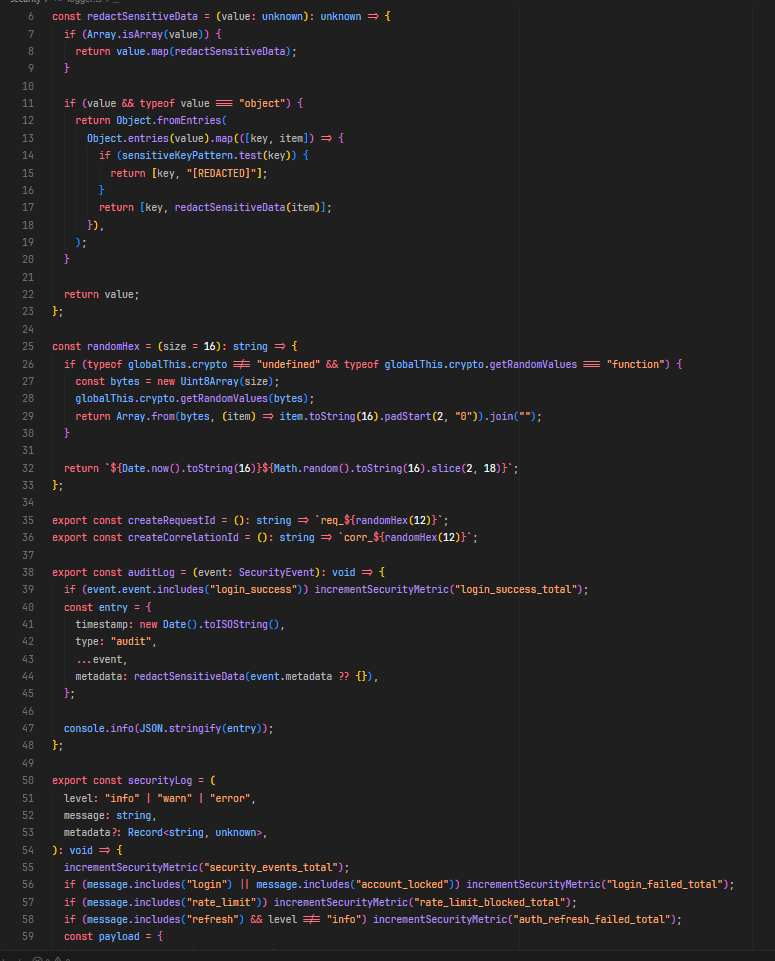

arquivo `security/metrics.ts` — linhas 1 a 36 — mostrar nomes e armazenamento em memória dos contadores
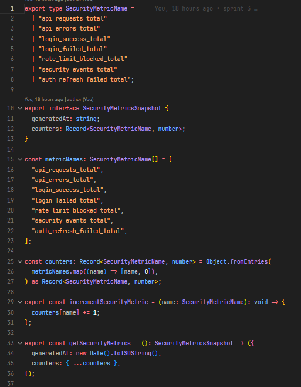

arquivo `app/api/security/status+api.ts` — linhas 8 a 30 — mostrar endpoint e métricas expostas
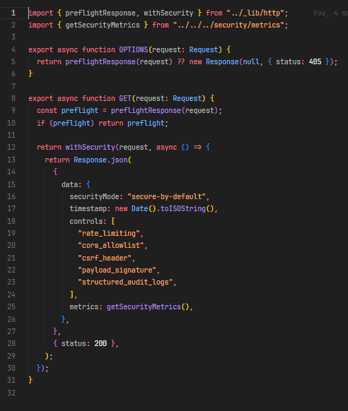

terminal — comando `npm run test:security` — mostrar saída real dos testes; executar antes de capturar]
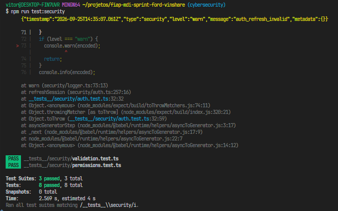

### Fluxo de resposta a incidentes

Este é um procedimento proposto para o protótipo, sem equipe SOC/SIEM operacional no repositório:

1. **Detecção:** identificar evento no log local, como falha de autenticação, replay, bloqueio de limite ou erro repetido da API. Em produção, alertas deverão vir do coletor central.
2. **Análise:** correlacionar timestamp, request ID, correlation ID e endpoint sem copiar tokens ou dados pessoais para o ticket.
3. **Contenção:** revogar sessões afetadas; limitar temporariamente origem/conta na borda. Hoje a revogação é em memória e não é compartilhada entre instâncias.
4. **Erradicação:** corrigir causa, remover credencial comprometida e rotacionar segredo no gerenciador apropriado; preservar evidência necessária com acesso restrito.
5. **Recuperação:** publicar correção, validar autenticação e operações afetadas e restaurar serviço/dados a partir de backup se houver backend persistente.
6. **Pós-incidente:** documentar impacto, causa raiz, decisões, comunicação e testes de regressão. Obrigações de comunicação LGPD devem ser avaliadas pelo controlador e assessoria responsável conforme o caso.

## 5. Análise de risco STRIDE

Escala qualitativa para o protótipo: baixo/médio/alto. A probabilidade não foi estimada por teste de invasão; indica julgamento de risco sobre a arquitetura observada.

| STRIDE | Ativo/cenário Ford+ | Impacto / probabilidade | Controles presentes | Risco residual e ação |
|---|---|---|---|---|
| Spoofing | Conta/sessão de cliente | Alto / médio | Tokens curtos, rotação, lock e SecureStore para credenciais. | Alto: credenciais fixas de demonstração, auth local/memória e sem MFA/IdP. Substituir por IdP/backend. |
| Tampering | Veículo, perfil, agendamento e payload API | Médio / médio | Validação, RBAC, HMAC nas rotas demonstrativas. | Alto: chave HMAC padrão acadêmica quando ausente; dados de domínio no dispositivo. Remover fallback e centralizar persistência. |
| Repudiation | Mudanças e acesso administrativo | Médio / médio | Eventos JSON, timestamp e IDs de correlação. | Médio/alto: console volátil, sem armazenamento imutável ou relógio/identidade confiável. Centralizar logs com retenção. |
| Information Disclosure | Nome, e-mail, telefone, CPF mockado, placa/chassi e sessão | Alto / médio | Redaction, mascaramento na API, SecureStore para tokens. | Alto: AsyncStorage contém dados de domínio; logs não persistem; ausência de política de retenção. Minimizar e proteger dados no backend. |
| Denial of Service | API e consultas externas | Médio / médio | Limites por IP e ação; limites de payload. | Alto: estado local/em memória, sem proteção volumétrica/WAF e IP depende de proxy. Aplicar rate limit distribuído e edge control. |
| Elevation of Privilege | Acesso admin ou operação em veículo | Alto / baixo-médio | Verificação de permissões no código e rota de auditoria. | Médio/alto: papéis locais/mockados e roles user/analyst equivalentes. Usar autorização server-side ligada à identidade persistente. |

## 6. OWASP Mobile Top 10 — checklist específico

Os rótulos abaixo usam **CONTROLADO**, **PARCIAL**, **NÃO CONTROLADO** e **NÃO APLICÁVEL** conforme o nível de evidência atual.

| Categoria/risco | Aplicabilidade | Controle observado | Status | Evidência |
|---|---|---|---|---|
| Armazenamento inseguro | Aplicável | SecureStore apenas para sessão/refresh; dados funcionais em AsyncStorage. | PARCIAL | `services/storage.ts:21-59` |
| Criptografia insuficiente | Aplicável | Criptografia AES-GCM server-side demonstrativa; segredos e storage local têm lacunas. | PARCIAL | `app/api/_lib/serverCrypto.ts:6-23`; `payloadSignature.ts:10` |
| Autenticação/autorização inseguras | Aplicável | Sessão local, regras RBAC e tokens rotativos; credenciais fixas e sem IdP/MFA. | PARCIAL | `security/auth.ts:19-29,148-190,245-325`; `security/permissions.ts:3-44` |
| Comunicação insegura | Aplicável | Allowlist HTTPS para FIPE/ViaCEP; API verifica `x-forwarded-proto` apenas quando presente. | PARCIAL | `security/network.ts:5-33`; `app/api/_lib/http.ts:206-215` |
| Comunicação por plataforma inadequada | Parcial | Headers/cookies seguros nas rotas API; integração real/deploy não verificada. | PARCIAL | `app/api/auth/login+api.ts:66-73`; workflow/deploy |
| Código de qualidade insuficiente | Aplicável | Testes unitários e CodeQL configurado; cobertura é pequena e execução não verificada. | PARCIAL | `__tests__/security/`; `.github/workflows/security.yml:67-83` |
| Adulteração de código | Aplicável | CodeQL/Gitleaks configurados; sem verificação de integridade do app/atestado de dispositivo. | PARCIAL | `.github/workflows/security.yml` |
| Engenharia reversa | Aplicável | Sem proteção específica encontrada; código mobile pode ser inspecionado. | NÃO CONTROLADO | Não foi localizada proteção de ofuscação/anti-tamper |
| Funcionalidade extrínseca | Aplicável | Inventário revisável por dependências; não há relatório de revisão de permissões/capacidades. | PARCIAL | `package.json`, `app.json` |
| Funcionalidade extrínseca | Não há SDK de terceiros de analytics/ads identificado; revisão periódica ainda recomendada. | NÃO APLICÁVEL nesta versão | `package.json` |

O storage descrito neste checklist também é a evidência do controle Mobile; não é necessário um segundo print.

## 7. OWASP API Top 10 — checklist

| Categoria | Controle observado | Status | Evidência / lacuna |
|---|---|---|---|
| API1 Broken Object Level Authorization | Rotas existentes autenticam e checam permissões, mas não há persistência/escopo multiusuário robusto nem teste por objeto. | PARCIAL | `app/api/vehicles+api.ts:20-55`; validar propriedade de cada objeto quando houver banco. |
| API2 Broken Authentication | Token, refresh rotativo, lock; identidade demonstrativa local e estado volátil. | PARCIAL | `security/auth.ts:195-325` |
| API3 Broken Object Property Level Authorization | Validação de entrada e retorno mascarado na API de veículo; cobertura de propriedades limitada. | PARCIAL | `app/api/vehicles+api.ts:82-98`; `database.ts:51-77` |
| API4 Unrestricted Resource Consumption | Rate limit e limites do corpo existem, em memória e sem camada anti-DDoS. | PARCIAL | `app/api/_lib/http.ts:18-43,121-129` |
| API5 Broken Function Level Authorization | Permissão `security:admin` aplicada à auditoria; poucos endpoints e papéis mockados. | PARCIAL | `app/api/admin/audit+api.ts:26-33` |
| API6 Unrestricted Access to Sensitive Business Flows | Limites client/server básicos; sem antifraude ou controle persistente de abuso de fluxo. | PARCIAL | `security/rateLimiter.ts`; `app/api/_lib/http.ts` |
| API7 Server Side Request Forgery | Cliente limita destinos FIPE/ViaCEP por HTTPS e allowlist; endpoints não oferecem fetch arbitrário. | PARCIAL | `security/network.ts:5-33`; revisar se surgirem endpoints proxy. |
| API8 Security Misconfiguration | Headers, CORS, CSRF e tratamento seguro configurados; há discrepância de allowlist no preflight para CSRF. | PARCIAL | `app/api/_lib/http.ts:5-16,57-89` |
| API9 Improper Inventory Management | Rotas demonstrativas identificadas no repositório; sem inventário/deploy externo comprovado. | PARCIAL | `app/api/**`; documentar versões e endpoints publicados. |
| API10 Unsafe Consumption of APIs | URLs externas allowlisted e erros simplificados; parsing/contratos e disponibilidade dependem do fornecedor. | PARCIAL | `services/api.ts:9-42,44-100` |

## 8. OWASP ASVS — seleção aplicável

| Área | Controle observado | Status | Evidência | Observação |
|---|---|---|---|---|
| Authentication | Política de senha de demonstração, mensagens genéricas e tentativas limitadas. | PARCIAL | `security/auth.ts:88-104,195-243` | Identidade/segredo hardcoded; substituir antes de produção. |
| Session Management | Token curto, refresh rotativo, anti-replay, revogação. | PARCIAL | `security/auth.ts:148-167,245-313` | Sessão volátil em memória. |
| Access Control | Matriz RBAC e checagem em endpoint administrativo/veículos. | PARCIAL | `security/permissions.ts`; `app/api/admin/audit+api.ts` | Fonte de identidade não confiável para produção. |
| Validation | Schemas, limites, normalização e rejeição de chaves perigosas. | IMPLEMENTADO no protótipo | `security/validation.ts`; `app/api/_lib/http.ts:99-145` | Necessita testes mais amplos por rota. |
| Cryptography | SecureStore para credenciais, AES-GCM demonstrativo e HMAC. | PARCIAL | `services/storage.ts`; `serverCrypto.ts`; `payloadSignature.ts` | Fallback de segredo de assinatura e hash fraco impedem uso produtivo. |
| Error Handling | Erros públicos padronizados sem stack trace nos handlers protegidos. | IMPLEMENTADO no protótipo | `app/api/_lib/http.ts:175-203`; `security/errors.ts` | Confirmar também handlers fora do wrapper. |
| Logging | Logs JSON e redaction por chave. | PARCIAL | `security/logger.ts:4-77` | Console volátil; sem centralização/imutabilidade. |
| Data Protection | Mascaramento de placa/chassi e SecureStore para tokens. | PARCIAL | `app/api/_lib/database.ts:14-22,51-77`; `services/storage.ts` | AsyncStorage contém dados de domínio. |
| API Security | CORS, CSRF, rate limit, tamanho de corpo e IDs. | PARCIAL | `app/api/_lib/http.ts` | Preflight não anuncia header CSRF; deploy não avaliado. |

## 9. LGPD e inventário de dados

O código inclui dados mockados e campos/formulários para perfil, veículos e serviços. A tabela distingue esses dados de uma operação real: não foi encontrada integração com backend persistente Ford. A existência de dados de demonstração no bundle/repositório não comprova tratamento de titulares reais.

| Dado | Finalidade no protótipo | Armazenamento observado | Proteção/acesso | Retenção | Risco |
|---|---|---|---|---|---|
| Nome, e-mail, telefone e CPF mascarado em mock | Perfil e identificação demonstrativa | AsyncStorage e mocks do app | Validação e redaction parcial; UI local | Sem política formal; permanece até limpeza do app | Médio/alto se substituído por dados reais |
| Placa, chassi, marca/modelo, ano e quilometragem | Cadastro e visão de veículos | Mock/AsyncStorage; API demo mantém Map em memória e cifra placa/chassi | Mascaramento na resposta demo; dados locais não cifrados pelo app | Sem política formal | Alto para placa/chassi reais |
| Serviço, agendamento, concessionária e observações | Histórico e agendamento demonstrativo | AsyncStorage e mock de concessionárias | Validação; RBAC na lógica da interface | Sem política formal | Médio |
| Rewards, pontos e transações | Fidelização demonstrativa | AsyncStorage | Validação/controle de interface | Sem política formal | Baixo/médio |
| Access/refresh token e sessão | Autenticação acadêmica | SecureStore no dispositivo; sessões server demo em memória | SecureStore e rotação no módulo demonstrativo | Expiração de 15 min/7 dias; logout remove credenciais locais | Alto se usado fora da demonstração |
| CEP/endereço | Consulta ViaCEP no helper; não há localização GPS identificada | Requisição HTTPS externa quando a função é chamada | CEP sanitizado e destino allowlisted | Retenção externa depende do fornecedor; não auditada | Médio |

Não foram identificadas coleta de geolocalização, telemetria veicular ou mensagens MQTT. A configuração de `Permissions-Policy` desabilita geolocalização/câmera/microfone no contexto web; isso não prova inexistência de todo tratamento no futuro. Aplicar minimização, finalidade, transparência, controle de acesso, retenção e exclusão com base legal definida pelo controlador antes de inserir dados reais. O repositório não documenta processo de atendimento a titulares, encarregado, registro formal de operações ou resposta regulatória.

## 10. Segurança contínua e recuperação

| Rotina | Estado atual | Processo recomendado |
|---|---|---|
| Revisão de dependências | Dependabot semanal e `npm audit` configurados no CI. | Revisar PRs semanalmente; corrigir achados altos/críticos com prioridade e registrar exceções com prazo. |
| SAST | CodeQL no workflow; regras Semgrep locais sem job provisionado. | Rever achados em PR; decidir se Semgrep será executado no CI como gate. |
| Secret scanning | Gitleaks configurado no workflow. | Manter scan em PR/push; revogar imediatamente segredo exposto e revisar histórico. |
| Testes de segurança | Script e 8 testes em três suítes existentes; execução não verificada nesta tarefa. | Executar `npm run test:security` em PR e ampliar cobertura dos endpoints, limites e autorização por objeto. |
| Auditoria de permissões | Matriz no código; não há rotina operacional registrada. | Revisar em cada release e trimestralmente: contas/papéis, escopo por recurso e ações administrativas. |
| Logs e alertas | Console e painel em memória, sem SIEM. | Produção: coletor central, acesso restrito, retenção, alerta de login/replay/5xx e revisão de falsos positivos. |
| Backup | NÃO IMPLEMENTADO para servidor: não há banco persistente. Dados móveis locais não têm backup governado pelo projeto. | Ao adotar banco, definir escopo, criptografia, retenção e teste periódico de restauração. |
| Recuperação/DR | NÃO IMPLEMENTADO. | Definir RPO/RTO e runbook de acordo com arquitetura real; testar recuperação antes de produção. |

Nenhum backup multi-região ou plano de DR foi encontrado. Os processos recomendados são **PLANEJADOS PARA PRODUÇÃO**, não capacidades atuais.

## 11. Limitações verificadas

- Autenticação e sessão acadêmicas em memória; identidade de demonstração e credenciais pré-preenchidas no cliente.
- Fallback de hash de senha fraco sem Web Crypto e segredo padrão acadêmico no código de assinatura de payload.
- Interface autentica localmente e não usa os endpoints API de auth demonstrativos.
- Sem JWT, MFA, backend dedicado de identidade ou armazenamento persistente de servidor.
- Dados de domínio em AsyncStorage sem criptografia do app.
- Rate limiting e métricas em memória, sem distribuição, SIEM ou alertas externos.
- Logs JSON apenas no console e sem armazenamento imutável.
- SAST/SCA/secret scan configurados; execução no GitHub não foi comprovada nesta auditoria. Semgrep não integra o workflow.
- Sem branch protection/deploy gate demonstrado; sem container, IaC, MQTT, telemetria, ML ou GPS no escopo atual.
- Sem backup/recovery persistente; sem política formal de retenção ou processo documentado para direitos de titulares.
- O preflight CORS não lista `X-CSRF-Token` entre os headers permitidos, embora o wrapper exija esse header para escrita.

## 12. Checklist final de conformidade da Sprint 3

`ATENDIDO`, `PARCIAL`, `NÃO ATENDIDO` e `NÃO APLICÁVEL` descrevem presença no protótipo/configuração, não aprovação externa ou execução confirmada.

| Requisito Sprint 3 | Status | Evidência |
|---|---|---|
| SAST | PARCIAL | CodeQL configurado; execução não comprovada; Semgrep fora do CI. |
| SCA | PARCIAL | `npm audit`/Dependabot configurados; resultado atual não executado nesta tarefa. |
| Secret Scanning | PARCIAL | Gitleaks configurado; execução não comprovada. |
| Container Security | NÃO APLICÁVEL | Sem Dockerfile/imagem. |
| Criptografia local | PARCIAL | SecureStore para sessão; dados de domínio em AsyncStorage. |
| API hardening | PARCIAL | Headers, CORS, CSRF e tratamento; lacunas de integração/preflight/deploy. |
| Rate limit | PARCIAL | Controles em memória, não distribuídos. |
| Input validation | ATENDIDO | Validação e sanitização no protótipo; cobertura pode ser ampliada. |
| JWT | NÃO ATENDIDO | Tokens opacos, não JWT. |
| RBAC | PARCIAL | Matriz e checagens existem; identidade/papéis mockados. |
| MQTT/TLS | NÃO APLICÁVEL | Sem MQTT/IoT. |
| IaC | NÃO ATENDIDO | Sem Terraform/Kubernetes ou IaC equivalente. |
| Logs | PARCIAL | JSON/redaction no console, sem persistência central. |
| Metrics | PARCIAL | Contadores em memória; `api_requests_total` não cobre toda requisição. |
| Alerts | NÃO ATENDIDO | Sem alertas externos/plantão. |
| Dashboard | PARCIAL | Painel local da execução atual, sem histórico/alerta central. |
| Incident Response | PARCIAL | Fluxo definido neste documento; operação formal não existe no repositório. |
| STRIDE | ATENDIDO | Análise específica do Ford+ neste documento. |
| ASVS | PARCIAL | Seleção de controles aplicáveis; sem verificação independente. |
| Mobile Top 10 | PARCIAL | Checklist específico com lacunas explícitas. |
| API Top 10 | PARCIAL | Checklist para rotas existentes; cobertura limitada. |
| LGPD | PARCIAL | Inventário e princípios documentados; processos corporativos não demonstrados. |
| Dependency Review | PARCIAL | Dependabot semanal e audit configurados; revisão/resultado não comprovados. |
| Security Testing | PARCIAL | Testes existem; execução nesta auditoria não realizada. |
| Permission Audit | PARCIAL | RBAC no código; rotina periódica proposta, não operacional. |
| Backup | NÃO ATENDIDO | Sem banco persistente ou backup do servidor. |
| Recovery | NÃO ATENDIDO | Sem plano de recuperação testado. |

## 13. Conclusão

Ford+ tem uma base acadêmica de controles: validação, RBAC, sessões com rotação, limitação de tentativas, headers HTTP, logs estruturados, métricas locais, testes e scanners configurados. A maturidade permanece de protótipo: fluxo de autenticação é local, estado e observabilidade são voláteis, há credenciais e fallbacks de demonstração no código, dados de domínio usam AsyncStorage e não há operação de segurança persistente.

Antes de produção, os passos prioritários são remover credenciais/fallbacks de demonstração, integrar identidade e autorização server-side, persistir e proteger dados, configurar secrets em cofre, fechar a compatibilidade de CSRF/preflight, tornar CI gates verificáveis, centralizar logs/alertas e definir backup, retenção e resposta a incidentes.

## Checklist de prints que o aluno precisa tirar

Os itens seguem a ordem dos marcadores no documento. Os trechos de código podem ser capturados no editor com numeração de linhas; capturas de execução devem ser feitas após rodar o fluxo real.

- [ ] 01 — Pipeline completo. Onde: GitHub Actions. O que abrir: `Security Pipeline`. Mostrar: jobs e estados reais.
- [ ] 02 — CodeQL. Onde: GitHub Actions. O que abrir: job `CodeQL SAST`. Mostrar: conclusão/resultado.
- [ ] 03 — Gitleaks. Onde: GitHub Actions. O que abrir: job `Secret Scanning`. Mostrar: conclusão/resultado.
- [ ] 04 — npm audit. Onde: GitHub Actions. O que abrir: `Dependency and Audit Scan`. Mostrar: saída real, inclusive achados/falha.
- [ ] 05 — Dependabot. Onde: GitHub. O que abrir: configurações/PRs de dependência. Mostrar: agenda semanal ou atualização criada.
- [ ] 06 — Sessão e lifecycle. Onde: `security/auth.ts`, linhas 19–29 e 245–325. Mostrar: TTL, estado em memória, rotação, replay, revogação e verificação de access token.
- [ ] 07 — Limitações de autenticação. Onde: `security/auth.ts`, linhas 55–85 e 170–190. Mostrar: fallback de hash e identidade de demonstração.
- [ ] 08 — Login pré-preenchido. Onde: `app/sign-in.tsx`, linhas 13–18. Mostrar: credenciais default da demonstração.
- [ ] 09 — RBAC. Onde: `security/permissions.ts`, linhas 3–44. Mostrar: papéis e permissões.
- [ ] 10 — Guarda administrativa. Onde: `app/api/admin/audit+api.ts`, linhas 15–33. Mostrar: verificação de token e permissão admin.
- [ ] 11 — HTTP hardening. Onde: `app/api/_lib/http.ts`, linhas 5–20 e 30–71. Mostrar: allowlist, headers, rate limit e CSRF.
- [ ] 12 — Parsing seguro. Onde: `app/api/_lib/http.ts`, linhas 73–145 e 148–214. Mostrar: preflight, payload, prototype pollution e erro seguro.
- [ ] 13 — Validação de veículo. Onde: `security/validation.ts`, linhas 32–66. Mostrar: ID e validação por campos.
- [ ] 14 — Sanitização. Onde: `security/sanitization.ts`, linhas 3–45. Mostrar: normalização e filtros.
- [ ] 15 — Storage local. Onde: `services/storage.ts`, linhas 21–59. Mostrar: chaves SecureStore e AsyncStorage.
- [ ] 16 — Criptografia server demo. Onde: `app/api/_lib/serverCrypto.ts`, linhas 6–23. Mostrar: segredo, AES-GCM e IV aleatório.
- [ ] 17 — Assinatura HMAC e fallback. Onde: `app/api/_lib/payloadSignature.ts`, linhas 5–28 e 40–57. Mostrar: HMAC e fallback acadêmico.
- [ ] 18 — Expo config. Onde: `app.json`, linhas 35–52. Mostrar: plugins e headers.
- [ ] 19 — Logs e redaction. Onde: `security/logger.ts`, linhas 4–22 e 38–77. Mostrar: mascaramento e logs JSON.
- [ ] 20 — Métricas em memória. Onde: `security/metrics.ts`, linhas 1–36. Mostrar: contadores e snapshot.
- [ ] 21 — Dashboard local. Onde: app em execução, aba Segurança. Mostrar: contadores e atualização.
- [ ] 22 — Endpoint de status. Onde: `app/api/security/status+api.ts`, linhas 8–30. Mostrar: métricas retornadas.
- [ ] 23 — Testes de segurança. Onde: terminal. Comando: `npm run test:security`. Mostrar: resultado real das suítes.

## Referências de código e configuração

Arquivos citados no documento: `package.json`, `app.json`, `.github/workflows/security.yml`, `.github/dependabot.yml`, `.semgrep.yml`, `security/auth.ts`, `security/permissions.ts`, `security/validation.ts`, `security/sanitization.ts`, `security/rateLimiter.ts`, `security/logger.ts`, `security/metrics.ts`, `security/network.ts`, `services/storage.ts`, `services/api.ts`, `services/runtimeHardening.ts`, `app/+middleware.ts`, `app/api/_lib/http.ts`, `app/api/_lib/database.ts`, `app/api/_lib/serverCrypto.ts`, `app/api/_lib/payloadSignature.ts`, rotas `app/api/**`, `hooks/useAuth.tsx`, `app/sign-in.tsx`, `app/(tabs)/security.tsx` e `__tests__/security/**`.

Expo SDK no `package.json`: `~55.0.25`; a referência consultada para esta auditoria foi a [documentação oficial versionada do Expo SDK 55](https://docs.expo.dev/versions/v55.0.0/).
