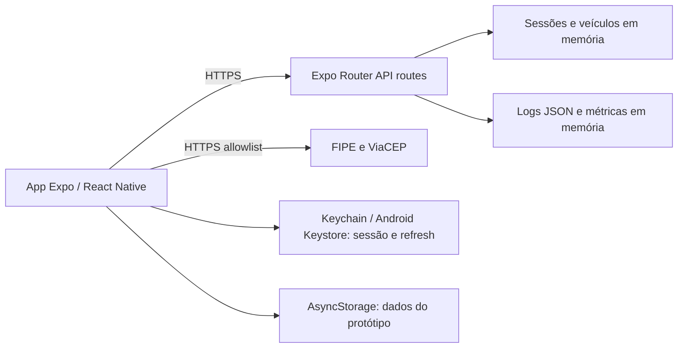
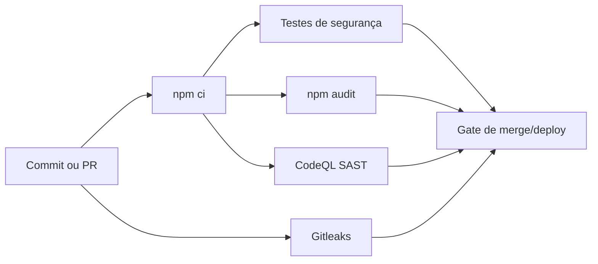

# CYBERSECURITY — FORD+ — SPRINT 3

## 1. Escopo e diagnóstico

Ford+ é o protótipo mobile do desafio Ford VIN Share. Ele trata conta, sessão, perfil, veículos (placa e chassi), serviços, agendamentos, recompensas e consultas FIPE/ViaCEP. Não trata telemetria, localização, IoT/MQTT, containers, Terraform, Kubernetes ou banco persistente.

| Requisito | Status | Evidência |
|---|---|---|
| SAST | PARCIAL | CodeQL no workflow; o comando Semgrep local não está provisionado |
| SCA | IMPLEMENTADO COM PENDÊNCIAS | `npm audit` no workflow e Dependabot semanal; audit atual encontra 9 vulnerabilidades altas |
| Secret scanning | IMPLEMENTADO | Gitleaks no workflow |
| Container security | NÃO APLICÁVEL | Não há Dockerfile/imagem de container |
| JWT | NÃO IMPLEMENTADO | Sessões usam tokens opacos em memória; não são JWT assinados |
| Autenticação e sessão | PARCIAL | access token curto, refresh rotativo/revogável e anti-replay em `security/auth.ts`; armazenamento e identidade são em memória |
| RBAC | IMPLEMENTADO | `security/permissions.ts`, hooks e `/api/admin/audit` |
| Rate limiting | IMPLEMENTADO COM LIMITAÇÃO | `security/rateLimiter.ts` e `app/api/_lib/http.ts`; estado em memória e não distribuído |
| Validação de entrada | IMPLEMENTADO | `security/validation.ts`, `security/sanitization.ts`, `parseJsonBody` |
| Criptografia local | PARCIAL | sessão/refresh no Keychain/Keystore com `expo-secure-store`; demais dados ficam em AsyncStorage |
| Logs estruturados e auditoria | IMPLEMENTADO | `security/logger.ts` com JSON, redaction e IDs de correlação |
| Métricas, alertas e dashboard | PARCIAL | contadores reais em memória (`security/metrics.ts`), endpoint de status e aba Segurança; sem alertador externo/persistência |
| Testes de segurança | IMPLEMENTADO | 8 testes em `__tests__/security` |
| STRIDE | IMPLEMENTADO | seção 5 |
| OWASP Mobile/API/ASVS | IMPLEMENTADO | seção 6 |
| LGPD | IMPLEMENTADO | seção 7 |
| Resposta a incidentes | IMPLEMENTADO | seção 8 |
| Backup/recovery e segurança contínua | PARCIAL | plano documentado; protótipo não tem persistência de servidor |

> A versão anterior de `CYBERSECURITY.md` não deve ser usada como evidência final: ela afirmava criptografia AES-GCM com uma variável `EXPO_PUBLIC_STORAGE_SECRET`. Variáveis `EXPO_PUBLIC_*` vão ao bundle e não são segredos. O controle foi removido para as credenciais: agora elas usam SecureStore nativo. Dados de domínio ainda em AsyncStorage são uma limitação explícita.

## 2. Arquitetura e superfície de ataque

Trust boundaries: dispositivo/armazenamento local; rede para APIs externas; requisições ao servidor Expo; e o processo de CI. O acesso aos endpoints protegidos usa token de acesso, verificação de permissão e validação de payload. O endpoint administrativo requer `security:admin`.

## 3. Pipeline DevSecOps

`.github/workflows/security.yml` executa testes, `npm audit --audit-level=high`, Gitleaks e CodeQL em PRs e push para `main`/`master`. `.github/dependabot.yml` abre atualizações npm semanais. Container scan não se aplica. Semgrep não é gate atual: `.semgrep.yml` existe, mas `npm run security:sast` falha pois Semgrep não está instalado no ambiente; antes de adotá-lo, deve-se provisioná-lo no CI e fazer o job falhar em achados de severidade definida.

Risco reduzido: testes evitam regressão dos controles; CodeQL busca padrões de código inseguros; audit/Dependabot acompanham componentes vulneráveis; Gitleaks impede credenciais versionadas.

## 4. Segurança em código e observabilidade

- Autenticação: token de acesso de 15 minutos, refresh de 7 dias com rotação, detecção de replay, logout/revogação, mensagens genéricas e lock/rate limit. É uma demonstração em memória, não uma implementação de identidade produtiva nem JWT.
- APIs: CORS allowlist, cabeçalho CSRF em escrita, assinatura HMAC de payload, limite de body, rejeição de JSON inválido/prototype pollution, headers de segurança e erros sem stack trace.
- Entrada/RBAC: normalização NFKC, rejeição de caracteres e padrões maliciosos, schemas específicos e permissões explícitas.
- Dados: `expo-secure-store` armazena sessão e refresh com Keystore/Keychain. A API cifra placa/chassi em memória usando chave de servidor `API_HMAC_SECRET` (mínimo 32 caracteres). Não existe segredo forte no bundle mobile.
- Logs: `auditLog` e `securityLog` geram JSON com redaction de senha, token, e-mail, telefone, CPF e chassi; API anexa `X-Request-ID` e `X-Correlation-ID`.
- Métricas: `api_requests_total`, `api_errors_total`, `login_success_total`, `login_failed_total`, `rate_limit_blocked_total`, `security_events_total` e `auth_refresh_failed_total`. Elas são incrementadas por eventos reais e mostradas em `app/(tabs)/security.tsx` e em `/api/security/status`.

Alertas implementados são locais: bloqueio de rate limit, lock, replay e erro de API geram logs estruturados. Alertas externos (e-mail, PagerDuty, Grafana Alerting) não estão implementados porque não há backend/stack de monitoramento persistente. Para produção, exportar esses contadores a um coletor e alertar em falhas repetidas de login, 5xx e bloqueios de rate limit.

## 5. STRIDE e riscos

| STRIDE | Ativo/cenário | Impacto / probabilidade | Controle e risco residual |
|---|---|---|---|
| Spoofing | Credenciais e sessão roubadas | Alto / médio | token curto, rotação, revogação e SecureStore; residual alto sem backend de identidade/MFA |
| Tampering | Payload de veículo alterado | Médio / médio | HMAC, validação e allowlist; chave HMAC precisa cofre de secrets em produção |
| Repudiation | Alteração de veículo/serviço | Médio / médio | audit JSON e IDs; residual médio, pois log não é imutável |
| Information disclosure | placa, chassi e perfil | Alto / médio | redaction, mascaramento no retorno e SecureStore só para credenciais; residual médio por AsyncStorage |
| Denial of service | brute force/flood de API | Médio / alto | limites e lock em memória; residual médio em múltiplas instâncias |
| Elevation of privilege | usuário acessa auditoria | Alto / baixo | RBAC e `security:admin`; residual médio, pois identidades são mockadas |

## 6. Mapeamentos OWASP e ASVS reduzido

| Referência | Situação Ford+ | Status |
|---|---|---|
| OWASP Mobile: armazenamento inseguro | SecureStore para tokens; dados de domínio ainda em AsyncStorage | PARCIAL |
| OWASP Mobile: autenticação/autorização | sessão curta, rotação e RBAC | PARCIAL |
| OWASP Mobile: comunicação insegura | URLs externas HTTPS allowlisted; TLS final depende da infraestrutura | PARCIAL |
| OWASP Mobile: código/privacidade | captura de tela bloqueada quando o módulo está disponível; sem RASP | PARCIAL |
| OWASP API: BOLA/BFLA | validação de token e permissões em endpoints existentes | PARCIAL |
| OWASP API: autenticação quebrada | lock, rotação, revogação e anti-replay; memória/local | PARCIAL |
| OWASP API: consumo de recursos | body limit e rate limit | PARCIAL |
| OWASP API: misconfiguration | CORS, headers e erros seguros | IMPLEMENTADO |
| ASVS V2/V3/V4 | autenticação, sessão e acesso conforme controles acima | PARCIAL |
| ASVS V5 | validação, normalização e limite de payload | IMPLEMENTADO |
| ASVS V7/V8/V9 | tratamento de erro, logs com redaction e proteção de dados | PARCIAL |

## 7. LGPD no protótipo

| Dado | Finalidade/local | Proteção, acesso e retenção | Risco |
|---|---|---|---|
| nome, e-mail, telefone | perfil; AsyncStorage | validação/redaction; usuário autenticado; sem política de expurgo | médio |
| placa, chassi, veículo | gestão do veículo; AsyncStorage/API em memória | mascaramento nas respostas; cifragem somente em memória no servidor | alto |
| serviços/agendamentos/rewards | histórico e relacionamento; AsyncStorage | RBAC de interface; sem retenção formal | médio |
| tokens/sessão | autenticação; Keychain/Keystore | SecureStore, rotação e revogação | médio |

Não há coleta identificada de localização ou telemetria. Este material é análise de privacidade do protótipo, não parecer jurídico. Produção precisa definir base legal, aviso de privacidade, retenção, atendimento a titulares e controles de operadores.

## 8. Resposta a incidentes

Para refresh token comprometido: (1) detectar por `auth_refresh_replay`/métricas; (2) correlacionar IDs e sessão; (3) revogar sessão e bloquear origem quando suportado; (4) analisar vetor e rotacionar segredo se necessário; (5) exigir novo login e validar operação; (6) registrar post-mortem e teste de regressão. O protótipo não possui SIEM nem bloqueio distribuído.

## 9. Segurança contínua e recovery

Implementado: Dependabot semanal, audit no CI, CodeQL, Gitleaks e testes de segurança. A cada release, revisar permissões/contas administrativas, achados de audit e logs de bloqueio. O estado da API é em memória e dados do app são locais; portanto não há backup/recovery de servidor implementado. Para produção com banco persistente: backups testados, restauração documentada, retenção e RPO/RTO definidos pela arquitetura escolhida.

## 10. Evidências a capturar

| Arquivo sugerido | Como obter | O que deve aparecer |
|---|---|---|
| `01-security-tests.png` | `npm run test:security` | 3 suítes/8 testes aprovados |
| `02-npm-audit.png` | `npm run security:audit` | resultado real, inclusive vulnerabilidades pendentes |
| `03-codeql.png` | aba Actions/Security do GitHub após PR | job CodeQL concluído |
| `04-gitleaks.png` | aba Actions do GitHub | job Gitleaks concluído |
| `05-dependabot.png` | aba Insights/Dependabot | configuração/PRs de dependência |
| `06-dashboard.png` | executar `npm run android`, autenticar e abrir Segurança | contadores da execução atual |
| `07-structured-logs.png` | `npm run test:security` | JSON de audit/security sem tokens expostos |
| `08-rate-limit.png` | teste manual de seis logins inválidos | resposta/bloqueio e log correspondente |

Não criar capturas artificiais. Salvar arquivos em `docs/cybersecurity/evidence/`.
